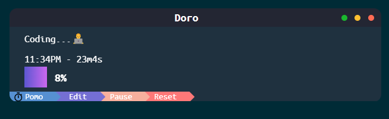

# Doro App

The Doro app is a timer application designed for managing Pomodoro sessions and breaks, now transformed into a Tauri-based application.



## Features

- **Pomodoro Timer**: Utilizes the Pomodoro Technique to boost productivity with work sessions and breaks.
- **Short and Long Breaks**: Offers breaks after Pomodoro sessions and longer breaks after specific intervals.
- **User Interface Enhancements**:
  - Displays the current timer mode.
  - Functionality for starting, pausing, and resuming the timer.
  - Editable mode for custom session names.
  - Dynamic display indicating timer progress.
  - Title bar buttons for minimizing, maximizing, and closing the app.

## Getting Started

To run the application locally, follow these steps:

1. **Clone the Tauri-based repository**:

    ```
    git clone https://github.com/Goldenbeehive/doro-tauri.git
    ```

2. **Install Tauri dependencies**:

    ```
    cd doro-tauri
    cargo install tauri-cli
    ```

3. **Run the Tauri app**:

    ```
    cargo tauri dev
    ```

This Tauri-based repository provides a more optimized file size and leverages Tauri's functionalities for building native applications.

## Usage

### Timer Controls

- **Start/Pause/Continue**: Click the button to start the timer. While running, click again to pause, and click once more to continue.
- **Reset**: Click on the Reset button to reset a timer after you start it.

### Editable Mode

- Click the "Edit" button to enable editing of the session name.
- Press "Enter" to save the edited name.

## Development

The app's source code is written using Rust for the backend and web technologies (HTML, CSS, JavaScript) for the frontend. Tauri provides an efficient way to bundle these technologies into a native application, ensuring a more compact file size and enhanced performance.

Refer to the [doro](https://github.com/Goldenbeehive/doro) repository for the Electron-based version of the Doro app (This one is outdated).